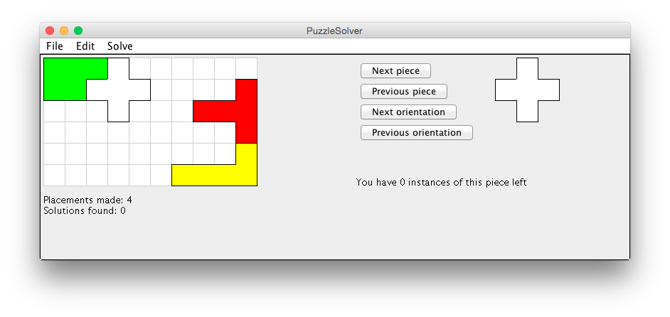

# PuzzleSolver

A program where you can create and solve your own puzzles. You can also use the built-in solver to solve your puzzles for you.

#### Loading a puzzle
Puzzles can be loaded by using File->Load puzzle and then opening a file in tests/files/\*Puzzle*.txt.

#### Editing a puzzle
A puzzle consists of a box and the pieces. For example SimplePuzzle.txt contains links to SimpleBox.txt and SimplePieces.txt. To change or add pieces or orientations edit the pieces file, edit the box file to change the box.

